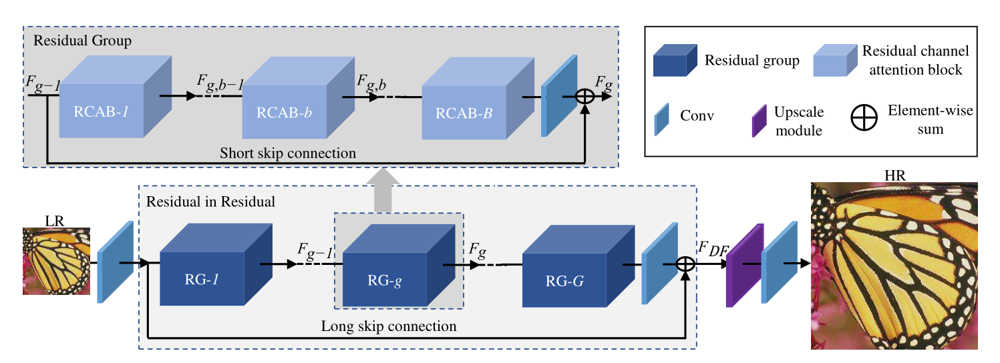
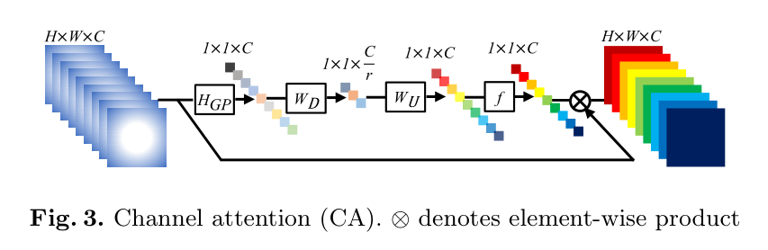
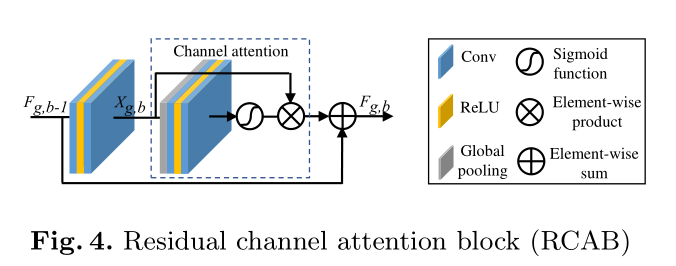
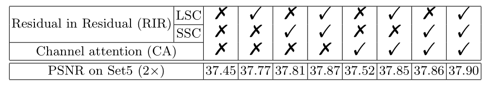
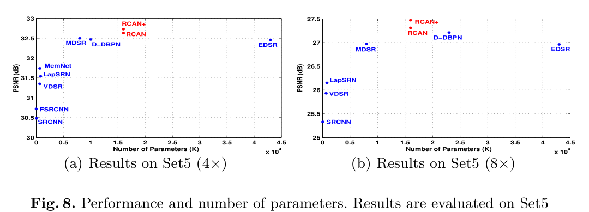

## 2018 ECCV
[(RCAN) Image Super-Resolution Using Very Deep Residual Channel Attention ](#2018eccvrcan)

### (RCAN) Image Super-Resolution Using Very Deep Residual Channel Attention Networks

##### 架构

<figure class="half">

</figure>

##### 模型配置
- G=10, B=20, C=64, r=16
##### 训练配置
- 训练集：DIV2K 1~800，8倍增广
- patchsize=48x48, batchsize=16
- ADAM, 默认值
- init_lr=1e-4, half per 200k iters
##### 实验结果

